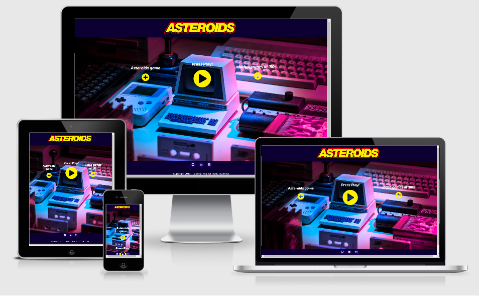
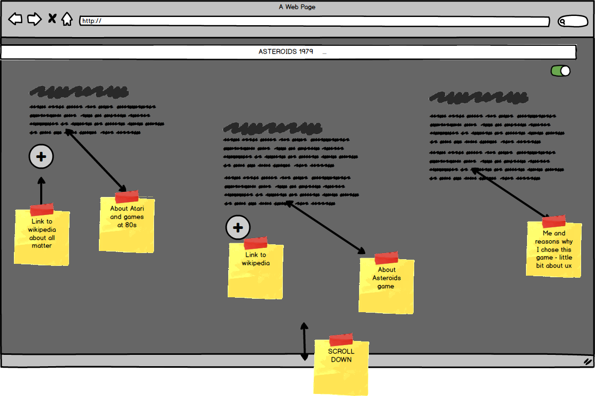
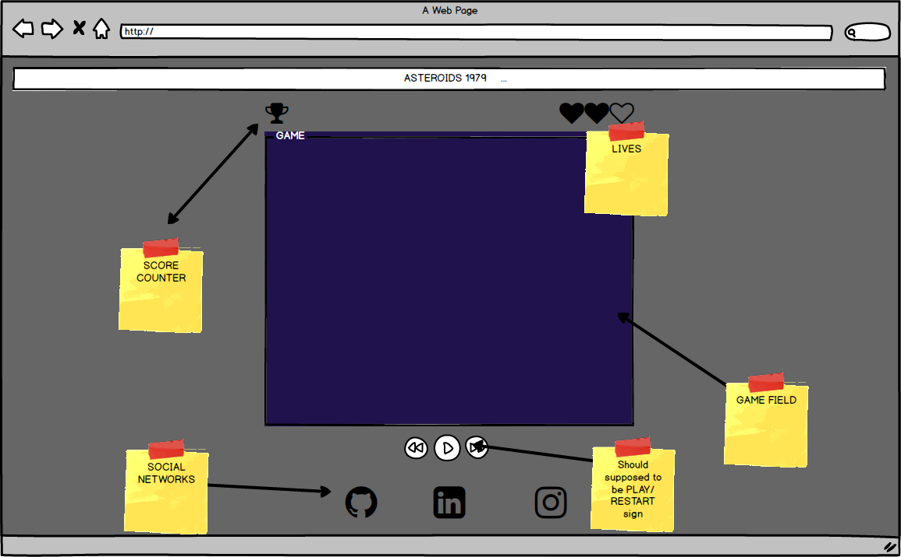

# Asteroids - Game from 1979

[Click Here to visit website](https://kireet7852.github.io/asteroids/)

Asteroids website is like a back to the past when the Internet was just a newborn and IT just had the first boom! After Atari and Commodore world became different forever! 

## UX

### '80s video games?
My website is prepared to acknowledge the young generation about video games from an era without www.
Most of them never heard of any gaming devices before XBOX and Playstation. '80s are trendy now, so I thought that I could help the new generation to understand how it was.
This website is made as well as a nostalgic journey for those who had a chance to play with Atari games when they were kids.

### Let`s go back!

On my website, the user can find out a little bit about Atari. there is a text section explaining the subject with a plus button attached linked to the Youtube channel where the subject is explained wider.
The same with the Asteroids game. On my website, you can find a short hint but history of a game but attached link to Wikipedia saying more about this matter.

### Why Asteroids?
Asteroids are one of my favourite games on Atari, after Tetris and Space Invaders.
Making Asteroids was a big challenge for me but at the same time pleasure to get it done.
Currently, I'm fascinated by the '80s era. Music, Film, culture, and art. That's kind of an era that I was a baby and had an impact on my young years. In the beginning, I wanted to make my website very dark. But things were

Finally, my project got colours inspired by my favorite tv show 

* [Stranger Things - Netflix series stylized on '80s](https://www.youtube.com/watch?v=YEG3bmU_WaI)

### User stories

* As Max, I want to have a unique experience and play with an old school game. so we can enjoy this service together.
* As Anna, I would like to show my friends a game that I used to play when I was a kid. 
* As a grandma, I want to be able to understand my kids and explore subjects close to their hearts. 

## Wireframes

## Features

### Elements on every page
 
#### Navbar

In existing Navabar there is just only one element - original logo Asteroids.
This logo works as a home button. Redirect player/user to the main page.

#### History section

History section contains 3 buttons styled in font awesome and background image showing old devices from the '80s.

* First plus button toggle modal content explains little about the history of Asteroids.
* Play Button in the middle has to redirect the user to go to the hidden section with game 
* Third last play button toggle another modal content but this time with embedded Youtube video about Atari and overall games from old times.

#### Game section

The game section contains a game build in Javascript and quick explanation whats the purpose of the game.
In this section, the user can find a button to reset a game and go back to the main page.
On small devices, the game is not available to play and user will find a piece of information to switch for a desktop version

#### Footer

On my page footer contains social links that connect directly to my Github page LinkedIn and Instagram.
From social links user can find out more about the owner of a website

### Features Left to Implement

* Game is working just only on a desktop version. Unfortunately, I didn't have time for playing with animations to build a touch control on mobile.
* There is one bug that I found out while testing - in my HTML left inline styling for canvas. I tried to fix that by adding styling in CSS but it breaks the whole website.

## Technologies used

* [Html](https://developer.mozilla.org/en-US/docs/Web/Guide/HTML/HTML5) - Core of the website

* [Css](https://developer.mozilla.org/en-US/docs/Web/CSS) - To make my website stylish

* [Javascript](https://developer.mozilla.org/en-US/docs/Web/JavaScript/Reference) - To make my game with and animate buttons

* [Jquery](https://jquery.com/) - to simplyfy DOM manipulation

* [Bootstrap](https://getbootstrap.com/docs/4.1/getting-started/introduction/) - Framework to make layout and content looking better

* [Fontawesome](https://fontawesome.com/) - Icons to make my website looking professional

* [GoogleFonts]( https://fonts.google.com/) - nice choice of fonts

* [Animista](http://animista.net/)  - to animate my icons

* [Mockup](http://ami.responsivedesign.is/#) - mockup for my readme

* [Git](https://git-scm.com/) -version control for my project

## Testing

I have done manual testing:

#### Hero section:

Asteroids Game plus button: - Try to press button, expected popup modal with text about the game - fully working
Press Play button -Try to press *play* - Try to press button, expected popup modal nested youtube video - fully working

Scrolling up and down on website works

#### Game 

Navigation of the ship when pressed a designed button - works
Laser shooting after tapping in space bar - works
Counting points after shooted asteroid - works
Saving the best score of a game - works
Losing lives after hitting by asteroids -works
I discovered one bug that I can not fix because of a lack of time. In HTML left inline styling for canvas. I tried to fix that by adding styling in CSS but it breaks the whole website.

How to run this project locally
---

1. Under the repository name, click "Clone or download".

2. In the Clone with HTTPs section, copy the clone URL for the repository.

3. In your local IDE open in Terminal.

4. Change the current working directory to the location where you want the cloned directory to be made.

5. Type git clone, and then paste the URL you copied in Step 3.

## Credits

**Content**

* [Wikipedia-Asteroids (video game)](https://bit.ly/2PMwBer)
* [liketotally80s](http://www.liketotally80s.com/2006/11/80s-atari/)
* [Main color scheme found on Visme.com  ](https://visme.co/blog/website-color-schemes/)

**Media**
* [Background photo used from Unsplash.com](https://bit.ly/34i6Iaa)
* [Original Asteroids logo](https://upload.wikimedia.org/wikipedia/commons/3/36/Asteroids_arcade_logo.png)

**Acknowledgements**

* [TraversyMedia](https://www.youtube.com/watch?v=vEROU2XtPR8)
* [W3schools](https://www.w3schools.com/tags/ref_canvas.asp)
* [CssTricks](https://css-tricks.com/)
* [StackOverflow](https://stackoverflow.com/)
* [Original game on Youtube](https://www.youtube.com/watch?v=9Ydu8UhIjeU)
